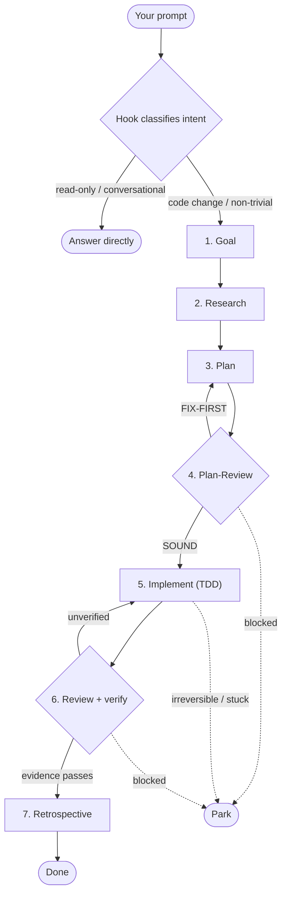
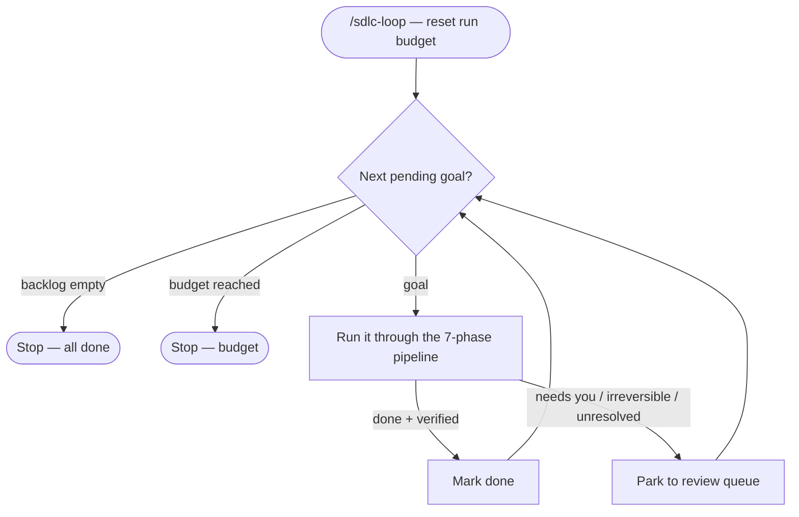

# LoopSmith

**Guardrails + an overnight autopilot for your AI coding agent.** Every non-trivial prompt is held to
a 7-phase SDLC spine — Goal → Research → Plan → Plan-Review → Implement → Review → Retrospective — so
the agent stops jumping straight to code. Then queue a backlog and let it **run autonomously**: each
goal moves across a **GitHub Projects board** (Backlog → In Progress → QC → Done) with a full audit
trail recorded on the issue. Two modes: **interactive** (intervention-driven) or **autonomous**
(park-and-continue).

The discipline borrows from [loop-maker](https://github.com/EricTechPro/loop-maker)'s loop
engineering — a checkable goal, durable-vs-changing state, a separate verifier, a mandatory budget,
and a non-skippable human gate — wrapped around the SDLC as the per-item engine.

> **Status (v0.5):** all commands shipped — the always-on **SDLC hook**, install paths,
> **`/sdlc-init`** (scaffold), **`/sdlc-goal`** (interactive mode), **`/sdlc-loop` +
> `/sdlc-status`** (autonomous loop driver), and a generic **`sdlc-plan-review`** (the Phase-4 gate
> `superpowers` doesn't provide). LoopSmith now **auto-installs** its companion plugins (see
> [Dependencies](#dependencies-auto-installed-companions)), and in **github-mode** it drives a
> **GitHub Projects v2 board** — mirroring each goal's status onto a kanban (new in v0.5).

## Quickstart

```
/plugin marketplace add <git-url-or-local-path>
/plugin install loopsmith
/sdlc-init --demo     # scaffolds a small, safe, runnable demo goal
/sdlc-loop            # watch it run Goal → Research → … → Review end-to-end
```

Add **`--github`** to `/sdlc-init` to also set up the GitHub Projects board + issue templates and run
the demo on a real board (Backlog → In Progress → QC → Done). Full setup:
[Your backlog](#your-backlog-local-files-or-github-issues).

---

## The pipeline

LoopSmith installs one always-on hook (`hooks/sdlc_gate.sh`, wired as a `UserPromptSubmit` hook).
On every prompt it classifies intent with fast, deterministic regex — **no LLM** — and injects the
matching SDLC directive:

- **code change / implementation** → "do NOT jump to editing; run the full spine from the GOAL and
  pass PLAN-REVIEW before any edit."
- **read-only / conversational** → "answer directly (say so) — but the moment it becomes a code
  change, switch to the spine."
- **anything else** → the standard 7-phase policy.

The hook is *advisory and fail-safe*: a false positive over-reminds, a false negative falls back to
the standard policy, and it always emits valid JSON (even on garbage or empty stdin). It never calls
out, never blocks — it shapes what the agent does next.

### How it falls through

A prompt enters through the always-on hook, which routes by intent. Code work then falls through the
seven phases — with two **gates** that can send it back, and a **park** exit for anything that needs you:



### The seven phases

1. **Goal** — restate the objective as one concrete, checkable goal. For feature/creative work, this
   is where you explore intent and requirements first.
   → *runs via* `superpowers:brainstorming`.
2. **Research** — map the blast radius: affected files, existing patterns, constraints, prior art.
   → *agent practice; no dedicated skill.*
3. **Plan** — write the plan: steps, files, tests, and a definition-of-done.
   → *runs via* `superpowers:writing-plans`.
4. **Plan-Review** — adversarially review the plan **before** any edit: verify each claim against the
   real code, stress-test what breaks after it ships, check scope/fit. Never skipped. This is the gate
   `superpowers` doesn't provide, so LoopSmith ships it.
   → *owned by* **`sdlc-plan-review`** (ships with LoopSmith).
5. **Implement** — build test-first and execute the plan step by step.
   → *runs via* `superpowers:test-driven-development` + `superpowers:executing-plans`.
6. **Review** — code-review the diff for real findings, then verify every claim with evidence before
   declaring anything done.
   → *runs via* `code-review` (`/code-review`) + `superpowers:requesting-code-review` +
   `superpowers:verification-before-completion`.
7. **Retrospective** — capture lessons; lock the critical insights so the next loop is better.
   → *agent practice; no dedicated skill.*

### Phase → owning skill

| # | Phase | What it does | Owning skill | Source |
|---|-------|--------------|--------------|--------|
| 1 | Goal | Restate the objective as one concrete, checkable goal | `brainstorming` | superpowers |
| 2 | Research | Map blast radius — files, patterns, constraints | *(agent practice)* | — |
| 3 | Plan | Write steps / files / tests / definition-of-done | `writing-plans` | superpowers |
| 4 | Plan-Review | Adversarially verify the plan against real code before any edit | **`sdlc-plan-review`** | **LoopSmith (ships)** |
| 5 | Implement | Build test-first; execute the plan | `test-driven-development`, `executing-plans` | superpowers |
| 6 | Review | Code-review the diff; verify claims with evidence before "done" | `/code-review`, `requesting-code-review`, `verification-before-completion` | code-review + superpowers |
| 7 | Retrospective | Capture lessons; lock critical insights | *(agent practice)* | — |

> `superpowers` and `code-review` are **recommended companions** (named in the hook policy + auto-installed) — **not hard dependencies**. LoopSmith names them for the phases above but **degrades gracefully**: without them, the phase names still guide the work.

### What LoopSmith ships vs relies on

**Ships in this kit** (`skills/` + `hooks/`) — zero runtime deps, bash + python3 stdlib only:

| Skill / component | Role |
|---|---|
| `hooks/sdlc_gate.sh` | The always-on, intent-aware hook that injects the 7-phase policy on every prompt |
| **`sdlc-plan-review`** | Phase-4 gate: adversarial plan review (the one phase superpowers doesn't cover) |
| **`/sdlc-init`** | Scaffold the per-project `.sdlc/` layer (project stub, goals, config, state) |
| **`/sdlc-goal`** | Interactive orchestrator: drive ONE goal through all 7 phases, pausing at each gate |
| **`/sdlc-loop`** | Autonomous orchestrator: drive the backlog through all 7 phases, park-and-continue |
| **`/sdlc-status`** | Report backlog counts + whether the review queue needs attention |

**Relies on** (auto-installed companions — see [Dependencies](#dependencies-auto-installed-companions)):

| Plugin | Skills used | Phases |
|---|---|---|
| `superpowers` | `brainstorming`, `writing-plans`, `test-driven-development`, `executing-plans`, `requesting-code-review`, `verification-before-completion` | 1, 3, 5, 6 |
| `code-review` | `/code-review` | 6 |

> The orchestrators (`/sdlc-goal`, `/sdlc-loop`) walk a goal through **all seven** phases; `/sdlc-init`
> and `/sdlc-status` set up and report on the work. The phase owners above are *who does the work* at
> each step — superpowers and code-review supply the execution muscle, LoopSmith supplies the spine,
> the Phase-4 gate, and the orchestration.

### Why not just superpowers?

`superpowers` gives you excellent **per-phase skills on demand**. LoopSmith is the layer *around* them
— and it works **without** them:

- **Always-on discipline** — the hook holds *every* prompt to the spine, so the agent can't skip
  planning. (superpowers is on-demand; this is the guardrail.)
- **The Phase-4 plan-review gate** — adversarial plan review before any code. superpowers has no such gate.
- **An autonomous loop** — park-and-continue over a backlog (local files, GitHub issues, or a GitHub
  Projects board) with a budget, status transitions, and a recorded audit trail. superpowers has no
  loop, no backlog, no board.
- **The project layer** — `.sdlc/` scaffolding, GitHub PM templates, the board, the optional knowledge graph.

In short: superpowers is *muscle* for four of the phases; LoopSmith is the **spine, the gate, and the
autonomous engine** that drives a whole backlog through all seven — and it names superpowers as a
recommended companion, not a hard dependency.

---

## The two modes

Both modes drive the **same seven phases** per goal — they differ in who's in the loop and what
happens at a checkpoint. The always-on hook underpins both.

### `/sdlc-goal <goal>` — interactive

One goal through the engine, **pausing for your approval at each gate**. Take a goal from
`.sdlc/goals/` (preferred — so it's tracked) or inline text, then walk Goal → Research → Plan →
**Plan-Review** (via `sdlc-plan-review`, never skipped) → Implement (test-first) → Review (evidence
before "done"). It does **not** auto-proceed past checkpoints — you approve each one. The outcome is
recorded to `.sdlc/` (`done`, or `parked` with a reason) so it shows in `/sdlc-status`.

### `/sdlc-loop` — autonomous

Pulls the backlog — local `.sdlc/goals/` files or [GitHub issues](#your-backlog-local-files-or-github-issues) —
and runs **each goal autonomously** through the same phases. Anything
that needs a human is **parked to `.sdlc/state/review-queue.md`** and the loop continues — it parks,
it does not force. It parks on:

- a hard checkpoint / a decision only you can make,
- an **irreversible or expensive action** (deploy, delete, overwrite, spend, migrate) — never run
  unattended,
- a failure it cannot resolve.

It halts on a **per-run iteration budget** (`config.json` → `budget.max_iterations`), which resets
each invocation and is resume-safe (a budget stop, re-run, picks up where it left off). Run
**`/sdlc-status`** any time for backlog counts (pending / in-progress / done / parked) + whether the
review queue needs attention.

The autonomous loop runs the backlog **park-and-continue** — it parks whatever needs you and keeps going:



| | `/sdlc-goal` (interactive) | `/sdlc-loop` (autonomous) |
|---|---|---|
| Scope | one goal | the whole `.sdlc/goals/` backlog |
| At a checkpoint | pauses for you | parks to the review queue, continues |
| Approval | every gate | only what it parks |
| Stops on | goal complete / you stop | backlog empty or per-run budget |
| Irreversible action | asks you | always parks — never runs it |

---

## Your backlog: local files or GitHub issues

Goals live in a backlog — you choose **where**, once, in `.sdlc/config.json` → `discovery.source`.
The loop runs the **same** way for both; only the source of goals and how status is recorded differ.

### Local goal files — default, zero-dep

Goals are markdown files under `.sdlc/goals/NNNN-slug.md`; the loop advances each file's frontmatter
`status: pending → in_progress → done | parked`, in filename order.

- **Add a goal:** copy `0001-example.md`, bump the number, fill `done_when` (a *checkable* condition).
- **Commit** `.sdlc/goals/`, `.sdlc/project.md`, `.sdlc/config.json`; **gitignore** `.sdlc/state/`
  (machine-written loop state — `/sdlc-init` prints this tip).
- **Parked** goals collect in `.sdlc/state/review-queue.md` — your "needs a human" list.

Everything stays in your repo; nothing leaves your machine. This is the zero-dependency path.

### GitHub issues — opt-in, needs the `gh` CLI

Treat **GitHub Issues as the backlog** so planning and triage live where your team already works:

```json
"discovery": {
  "source": "github",
  "github": {
    "repo": "",
    "goal_label": "sdlc:goal",
    "project": { "enabled": true, "status_field": "SDLC Status" }
  }
}
```

File each goal as an **issue labelled `sdlc:goal`** (the issue body is the goal). The loop maps SDLC
status onto GitHub — both the **issue** and (when the board is enabled) its **Projects card** — so the
backlog mirrors reality:

| SDLC status | On the issue | On the Projects board |
|---|---|---|
| pending (in backlog) | open issue labelled `sdlc:goal` | card set to **Backlog** |
| picked up → Research / Plan / Implement | adds the `sdlc:in-progress` label | card set to **In Progress** |
| Review (the quality cycle) | issue stays open | card set to **QC** |
| done | **closes** the issue with a completion comment | card set to **Done** |
| parked (needs you) | comments the reason, adds `sdlc:parked`, and removes `sdlc:goal` so it leaves the queue | card set to **Blocked** |

So your **review queue = open issues labelled `sdlc:parked`**, and **done = closed issues**;
**re-queue** a parked issue by re-adding the `sdlc:goal` label. The three labels are auto-created on
first run. **Setup:** run `gh auth login` once; leave `repo` empty to auto-detect from the git remote,
or set it to `owner/name`.

#### Projects v2 board (new in v0.5)

With `discovery.github.project.enabled` (on by default for new repos), the loop also drives a **GitHub
Projects v2 board**: on first run it finds-or-creates a board titled `<repo> — SDLC`, adds every
`sdlc:goal` issue as a card, and keeps one single-select **SDLC Status** field in sync
(**Backlog → In Progress → QC → Done**, **Blocked** for parked) as goals move — the table above. The
**QC** card move happens at the Review phase. It needs the `gh` token's **`project`** scope and is
**fail-open**: no scope, or any API error, and the loop simply continues on issues + labels (nothing
breaks). Tune it under `discovery.github.project` — `owner`/`title` (default `<repo> — SDLC`), `number`
(reuse an existing board), `status_field` (the field's name), and `columns` (override the column names
to match an existing board). A `gh`-aware `/sdlc-status` for github mode is still on the roadmap.

**Sprint / PM scaffolding.** Run **`/sdlc-init --github`** to also install GitHub project-management
hygiene into `.github/`: **epic** and **task** issue templates (epics decompose into task sub-issues),
a **bug** template, an **auto-add-to-project workflow** that drops every new issue into the board's
Backlog, a **critical-insight** comment template (record findings/decisions on the issue), and a
**label guide** (one `type` + ≥1 `component`/`area`). Enable auto-add by setting the repo variable
`SDLC_PROJECT_URL` and an `ADD_TO_PROJECT_PAT` secret.

**Recording the audit trail.** As the loop runs each phase, it records a journey-log note (and 🔒
critical insights for key decisions) — as a **comment on the task issue** in github mode, so the issue
timeline and the board card hold the full history, or appended to `.sdlc/journey/<goal>.md` in local
mode. Recording is **fail-open** (never breaks a run).

**Which to pick?** **Local** for a self-contained, zero-dependency repo where the backlog ships with
the code. **GitHub** to keep goals visible to your team, triaged in Issues/Projects, and tied to the
PRs the work produces.

---

## Knowledge graph (optional, off by default)

LoopSmith can accumulate a **knowledge graph** of what it learns, so research and analysis compound
across runs instead of evaporating. It's **opt-in** (`knowledge_graph.enabled: false` by default) and
built by an external tool (default **graphify**, `pip install graphifyy`) — the core stays zero-dep.

Two things feed it, for two objectives — *enhance the learnings* and *build a knowledge base around the
code*:
- **External research** — every `WebSearch` / `WebFetch` is auto-captured to
  `.sdlc/knowledge/research/web/` by a fail-open hook (only when KG is enabled; a hard no-op otherwise).
- **Internal analysis** — durable findings and Retrospective **lessons** you write to
  `.sdlc/knowledge/analysis/`.
- **The code** — graphed too, but only at `scope: full`.

Turn it on in `.sdlc/config.json`:
```json
"knowledge_graph": {
  "enabled": true,
  "scope": "full",
  "builder": "graphify",
  "auto_refresh": false
}
```
`scope` is **`full`** (code + external research + internal analysis) or **`research`** (skip code —
internal analysis + external research only). `auto_refresh: true` rebuilds the graph at the end of each
Retrospective.

Then **`/sdlc-kg`** builds, refreshes, and queries it. Querying via graphify **saves the answer back
into the graph** — each query makes the next one better (the learning-enhancement loop). The builder is
a **soft dependency**: if it isn't installed, `/sdlc-kg` says so and the rest of the SDLC runs
unaffected.

> Keep `.sdlc/knowledge/research/` and the builder's output (`graphify-out/`) out of git — they're
> machine-accumulated. Commit `.sdlc/knowledge/analysis/` to version your curated learnings.

## Install (plugin — recommended)

```
/plugin marketplace add <git-url-or-local-path>
/plugin install loopsmith
```

Installs the durable spine globally — the SDLC hook then fires in **every** project — and
**auto-installs the `superpowers` + `code-review` companions** (see below). Then run `/sdlc-init` in
each repo to scaffold its per-project `.sdlc/` layer (project stub, `goals/`, `config.json`, loop
`state/`). Re-running `/sdlc-init` is safe — it never clobbers existing state.

## Dependencies (auto-installed companions)

LoopSmith ships the *spine*; the *execution muscle* for Phases 1, 3, 5, and 6 lives in two companion
plugins it now declares as native dependencies:

- **`superpowers`** — `brainstorming`, `writing-plans`, `test-driven-development`, `executing-plans`,
  `requesting-code-review`, `verification-before-completion`.
- **`code-review`** — the `/code-review` skill.

When you `/plugin install loopsmith`, Claude Code **resolves and installs both automatically** and
lists them at the end of the install output. They're declared **unversioned**, so they track the
latest release in the official marketplace (no pinned git tags to resolve).

**Requirement:** you must have the **`claude-plugins-official`** marketplace added. It's the official
marketplace and ships **pre-registered** in current Claude Code, so this is normally already true.
LoopSmith's own `marketplace.json` allowlists it via `allowCrossMarketplaceDependenciesOn` — that
allowlist is what lets a dependency in *another* marketplace resolve.

**If a companion is missing** (e.g. the marketplace isn't registered, or it was disabled), Claude Code
marks LoopSmith with a **`dependency-unsatisfied`** error and disables it until resolved. Fixes, in
order of convenience:

1. Run the `claude plugin install …` command shown in the error, e.g.
   `claude plugin install superpowers@claude-plugins-official` (and/or `code-review@…`).
2. If the marketplace isn't registered, add it and Claude Code resolves the dependency automatically:
   ```
   claude plugin marketplace add anthropics/claude-plugins-official
   ```
   then `/reload-plugins`.
3. If a companion is merely disabled, enable it.

**Graceful degradation:** even with the companions absent, the always-on hook still injects the
7-phase policy and the phase *names* guide the work — LoopSmith **degrades, it does not break**. The
named superpowers/code-review skills are how each phase is executed *best*, not a hard runtime
requirement of the spine. (Ref: [plugin dependencies](https://code.claude.com/docs/en/plugin-dependencies).)

## Install (fallback — no plugin system)

```
git clone <git-url> && cd loopsmith && ./install.sh
```

`install.sh` copies the spine into `~/.claude/skills/loopsmith/` and **prints** the `settings.json`
hook snippet for you to paste (it never edits your settings — malformed JSON silently disables
hooks). Parse-check `settings.json` after pasting. The fallback installs **only** LoopSmith's own
spine — install `superpowers` and `code-review` yourself to get the phase-execution skills.

---

The always-on 7-phase hook underpins both modes. **See the [worked walkthrough](examples/hello-sdlc/)**
for a runnable end-to-end example. Publishing the kit as its own repo? See [EXTRACT.md](EXTRACT.md).

## Status (honest)

v0.4 is **Claude Code only.** The core is plain markdown + shell, structured to be host-portable, but
a second-host (Codex/etc.) adapter is not yet shipped.

## Requirements

- **Runtime:** bash + python3 (stdlib) — zero dependencies. The optional **GitHub backlog source**
  additionally needs the [`gh`](https://cli.github.com) CLI, authenticated (`gh auth login`); the
  default local source stays zero-dep.
- **Knowledge graph (optional):** the graph builder — default `graphify` (`pip install graphifyy`);
  off unless `knowledge_graph.enabled` is set.
- **Companions:** `superpowers` + `code-review` (auto-installed via the plugin path; manual on the
  fallback path).
- **Dev/test:** `pip install pytest`, then `pytest tests/ -v`.

## Credits & acknowledgements

LoopSmith stands on other people's work.

- **[loop-maker](https://github.com/EricTechPro/loop-maker)** by **Eric Tech ([@EricTechPro](https://github.com/EricTechPro))** — the design foundation. LoopSmith's loop engineering is built on loop-maker's ideas: a *checkable* goal, *durable-vs-changing* state, a *separate verifier*, a mandatory stop condition (*budget*), and a *non-skippable* human gate. That vocabulary lives on in LoopSmith's config schema (`discovery` / `verify` / `gates` / `budget`) and its portable-kit packaging (`install.sh` + `SKILL.md` + `templates/`). No code or text was copied — LoopSmith's scripts are original and self-contained — but the concepts and shape are its lineage. MIT-licensed, like this kit.
- **[superpowers](https://github.com/obra/superpowers)** by **Jesse Vincent ([@obra](https://github.com/obra))** — supplies the per-phase execution skills (brainstorming, writing-plans, test-driven-development, executing-plans, requesting-code-review, verification-before-completion). Auto-installed as a dependency.
- **[code-review](https://github.com/anthropics/claude-plugins-official)** by **Anthropic** — the `/code-review` skill used in the Review phase. Auto-installed as a dependency.

Both companion plugins install from the official **`claude-plugins-official`** marketplace.

## License

MIT. The companion plugins and loop-maker are each under their own licenses (superpowers, code-review, and loop-maker are all MIT at the time of writing).
