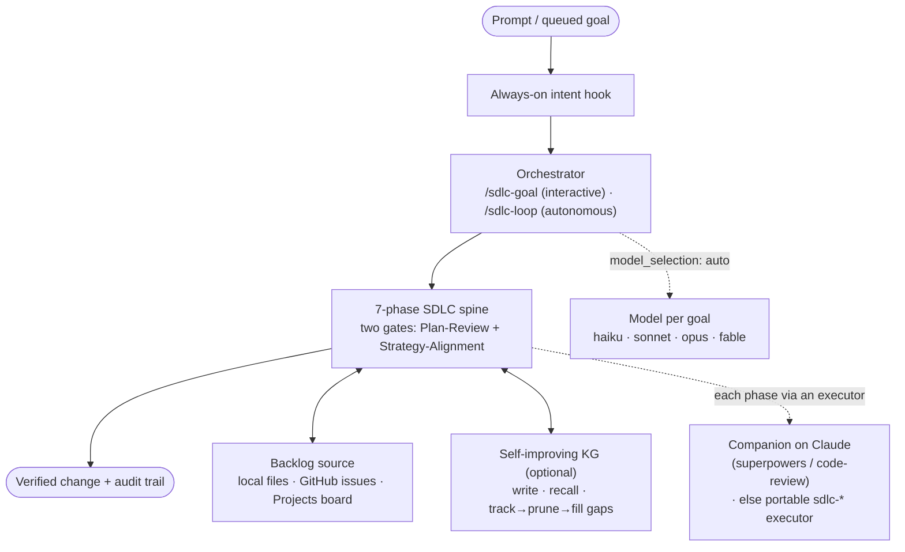
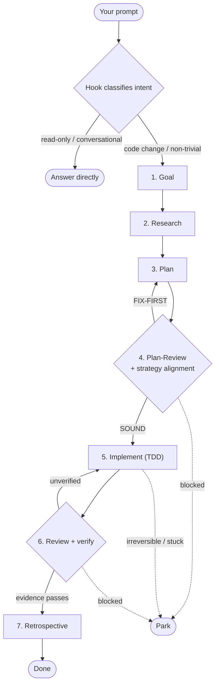
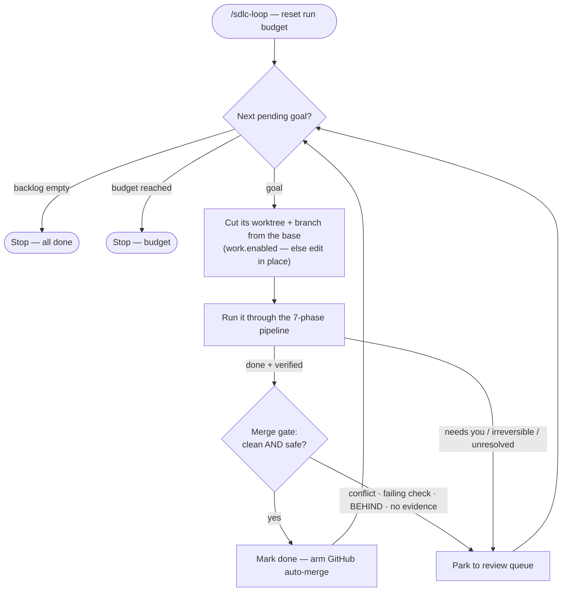

# LoopSmith

[](https://github.com/swapnil-agrim/loopsmith/actions/workflows/ci.yml)

**Guardrails + an overnight autopilot for your AI coding agent — one that plans before it codes, won't ship work that fights your strategy, and gets sharper every run.**

Drop it into any repo and every non-trivial prompt is held to a disciplined **7-phase SDLC** — Goal →
Research → Plan → Plan-Review → Implement → Review → Retrospective — so the agent stops jumping
straight to code. Then queue a backlog and let it **run autonomously**: each goal is driven to a
*verified* finish, moved across a **GitHub Projects board**, and recorded with a full audit trail.
Start from an existing repo **or** a product vision; LoopSmith grounds the work in your strategy and
remembers what it learns in a **self-improving knowledge graph**.

> **One promise: best-quality output, minimum effort.** Zero runtime deps (bash + python3 stdlib) and
> **zero hard plugin dependencies** — it installs seamlessly with or without anything else. If the
> `superpowers` + `code-review` companions are **already installed**, LoopSmith uses them
> automatically; if not, the portable `sdlc-*` executors run the same phases — **you install
> nothing**, on any host.

---

## Two ways to run: interactive or autonomous

Both modes drive the **same seven phases** per goal — they differ in who's in the loop and what
happens at a checkpoint. The repo-scoped prompt hook underpins both.

### `/sdlc-goal <goal>` — interactive

One goal through the engine, **pausing for your approval at each gate**. Take a goal from
`.sdlc/goals/` (preferred — so it's tracked) or inline text, then walk Goal → Research → Plan →
**Plan-Review** (via `sdlc-plan-review`, never skipped) → Implement (test-first) → Review (evidence
before "done"). It does **not** auto-proceed past checkpoints — you approve each one. The outcome is
recorded to `.sdlc/` (`done`, or `parked` with a reason) so it shows in `/sdlc-status`.

### `/sdlc-loop` — autonomous

Pulls the backlog — local `.sdlc/goals/` files or [GitHub issues](#your-backlog-local-files-or-github-issues) —
and runs **each goal autonomously** through the same phases. Anything
that needs a human is **parked to `.sdlc/state/review-queue.md`** and the loop continues — it parks,
it does not force. It parks on:

- a hard checkpoint / a decision only you can make,
- an **irreversible or expensive action** (deploy, delete, overwrite, spend, migrate) — never run
  unattended,
- a hard failure it cannot resolve — recorded as **`failed`** (needs a fix), distinct from
  parked (needs a decision), so the review queue separates the two.

It halts on the **per-run budgets** (`config.json` → `budget`) — `max_iterations`, `max_minutes`
(wall-clock from the run's start), and `max_tokens` (against spend the host reports via `loop.py
spend`; no reports means no token enforcement) — each enforced only when set; an absent/zero key
enforces nothing. All reset each invocation and are resume-safe (a budget stop, re-run, picks up
where it left off). Run
**Overnight without babysitting:** `bash skills/sdlc-loop/scripts/supervise.sh .sdlc` wraps the
loop in a zero-polling supervisor — blocked while a session runs, and on exit it classifies the
tail: loop finished → stop; per-run budget → relaunch; **usage-limit exhaustion → sleeps until the
stated reset time (+ jitter) and relaunches**; unknown crash → capped escalating backoff. Stop it
any time with `touch .sdlc/state/supervisor.stop`. (Sleeping *machine* ≠ sleeping process — on a
macOS laptop run it under `caffeinate -is`.) Run
**`/sdlc-status`** any time for backlog counts (pending / in-progress / done / parked / failed) + whether the
review queue needs attention.

| | `/sdlc-goal` (interactive) | `/sdlc-loop` (autonomous) |
|---|---|---|
| Scope | one goal | the whole `.sdlc/goals/` backlog |
| At a checkpoint | pauses for you | parks to the review queue, continues |
| Approval | every gate | only what it parks |
| Stops on | goal complete / you stop | backlog empty or per-run budget |
| Irreversible action | asks you | always parks — never runs it |

---

## The seven phases

Each phase runs via an **executor**, resolved per host: on Claude with the companion installed, the
`superpowers` / `code-review` skill; otherwise LoopSmith's **portable `sdlc-*` executor** — each with a
committed [parity review](docs/executor-parity/) showing it's at-par-or-better. Phase 4 is always
LoopSmith's own; no companion ships it.

1. **Goal** — restate the objective as one concrete, checkable goal. For feature/creative work, this
   is where you explore intent and requirements first.
   → *executor:* `superpowers:brainstorming` · portable `sdlc-brainstorm`.
2. **Research** — map the blast radius: affected files, existing patterns, constraints, prior art —
   then size the goal into a lane (`small`/`medium`/`large`) from what was actually measured, so small
   goals skip the ceremony they don't earn.
   → *executor:* **`sdlc-research`** (always LoopSmith's own — no companion equivalent).
3. **Plan** — write the plan: steps, files, tests, and a definition-of-done. Size it against real
   throughput with **`/sdlc-velocity`** (measured git pace), not "this feels like weeks."
   → *executor:* `superpowers:writing-plans` · portable `sdlc-plan`.
4. **Plan-Review** — adversarially review the plan **before** any edit: verify each claim against the
   real code, stress-test what breaks after it ships, check scope/fit, and (vision-first) check it
   against your strategy. Never skipped. This is the gate `superpowers` doesn't provide, so LoopSmith
   ships it.
   → *owned by* **`sdlc-plan-review`** (always LoopSmith's — no companion equivalent).
5. **Implement** — build test-first and execute the plan step by step.
   → *executor:* `superpowers:test-driven-development` + `executing-plans` · portable `sdlc-implement`.
6. **Review** — code-review the diff for real findings, then verify every claim with evidence before
   declaring anything done.
   → *executor:* `code-review` + `superpowers:requesting-code-review` + `verification-before-completion`
   · portable `sdlc-review` + `sdlc-verify`.
7. **Retrospective** — surface the structural + product debt the fix left behind, grade
   intent-vs-shipped, and route each durable lesson to the right store (advisory).
   → *executor:* **`sdlc-retro`** (always LoopSmith's own — no companion equivalent).

---

## Quickstart

Inside a Claude Code / Claude Desktop session:

```
/plugin marketplace add <git-url-or-local-path>
/plugin install loopsmith
/sdlc-init --demo     # scaffolds a small, safe, runnable demo goal
/sdlc-loop            # watch it run Goal → Research → … → Review end-to-end
```

Or from a terminal (same result — `claude plugin` is the CLI form of the same commands, useful for a
setup script or a non-interactive install):

```
claude plugin marketplace add <git-url-or-local-path>
claude plugin install loopsmith
```
then run `/sdlc-init --demo` and `/sdlc-loop` inside a session as above.

### Adopting into an existing repo? One command.

For a real project (existing code, a GitHub board, a team), skip the manual `config.json` edits and run:

```
/sdlc-setup
```

It detects the repo + board, scaffolds `.sdlc/` if needed, and writes a config with the defaults a
team actually wants — **github discovery scoped to `@me`, the ledger on, a PR per goal on** — then
bootstraps the ledger and runs `/sdlc-doctor`. It deliberately avoids two traps real adoptions hit: it
never enables `verify.enforce` without a real `verify.command` (that refuses every `done` forever), and
it never clobbers or narrows a git-ignore rule you already set (use `/sdlc-setup` with a local-only
scope to keep the repo's tracked files untouched). If your repo already gates source edits behind its
own `PreToolUse` hook, note that LoopSmith's Implement-phase edits go through it too — make sure
whatever it expects is satisfied.

That installs the plugin machine-wide, but the hook only speaks in repos that adopt the spine
(scoped to `.sdlc/` presence); `/sdlc-init` scaffolds
each repo's `.sdlc/` layer and is safe to re-run. If the `superpowers` + `code-review` companions are
**already** in your plugin list, LoopSmith uses them automatically; if not, the portable `sdlc-*`
executors run the same phases ([details](#companions-optional-enhancement)) — **nothing to install
either way**.

- Add **`--github`** to `/sdlc-init` to also set up the GitHub Projects board + issue templates and
  run the demo on a real board ([Your backlog](#your-backlog-local-files-or-github-issues)).
- Add **`--vision`** (or run **`/sdlc-vision`**) to start from a product vision instead
  ([Two ways to start](#two-ways-to-start-drop-in-or-vision-first)).

See the **[worked walkthrough](examples/hello-sdlc/)** for a runnable end-to-end example. Forking the
kit to publish it? See [EXTRACT.md](EXTRACT.md).

---

## What you get

Every option LoopSmith provides, at a glance:

| Capability | What it gives you | Command / component |
|---|---|---|
| **Repo-scoped guardrail** | Every prompt in an adopted repo held to the 7-phase spine — no jumping to code | `hooks/sdlc_gate.sh` (automatic) |
| **Plan-review gate** | Adversarial review of the plan *before* any edit — the gate `superpowers` doesn't ship | `sdlc-plan-review` |
| **Strategy-alignment gate** | A plan that contradicts your stated strategy / non-goals is blocked (FIX-FIRST) | `sdlc-plan-review` + north-star |
| **Two ways to start** | **Drop-in** (existing repo) or **vision-first** (start from a product vision) | `/sdlc-init`, `/sdlc-vision` |
| **One-command adoption** | Detects the repo + board, scaffolds `.sdlc/`, and writes a safe config (github discovery scoped to `@me`, ledger on, PRs on) — avoiding the verify-trap and never clobbering an ignore rule you already set | `/sdlc-setup` |
| **Two ways to run** | **Interactive** (approve each gate) or **autonomous** (park-and-continue over a backlog) | `/sdlc-goal`, `/sdlc-loop` |
| **Hard plan-gate (opt-in)** | With `gates.hard_plan_gate.enabled`, a source edit is mechanically DENIED until a fresh plan exists under `.sdlc/plans/` (`touch .sdlc/.allow-direct-edits` for a deliberate bypass) | `hooks/plan_gate.sh` |
| **Stop gate (opt-in)** | With `gates.stop_gate.enabled`, a session can't END with source changed but no fresh plan — the Stop-time counterpart to the plan-gate, so an interactive session doesn't quietly finish unplanned work | `hooks/completion_gate.sh` |
| **SessionStart brief (opt-in)** | With `session_start.enabled`, injects the SDLC policy + a doctor-lite install self-check at session start, so the conventions are in context before the first prompt | `hooks/session_start.sh` |
| **Machine-checked done** | With `verify.enforce`, "done" is refused until the goal's proving command passes THIS run | `loop.py verify` |
| **Bidirectional report card** | Declare your pipeline's stages once; every stage gets a forward (nothing dropped) + reverse (nothing invented) lane — uninstrumented lanes read ABSENT, never green — with a recurrence delta across runs | `.sdlc/pipeline.json` + `pipeline.py card` |
| **Model + effort auto-selection (opt-in)** | Per-goal ceiling AND per-step downgrade: mechanical steps run on a cheaper tier/effort (`model_selection: "auto"`, default off) | `predict.py resolve / resolve-step` |
| **Findings become work** | The card's failing signals become `proposed` goals (proof-of-fix pre-wired); the loop never runs one until you promote it | `pipeline.py propose` |
| **Team ledger (opt-in)** | A committed, append-only record of what the loop did — **one file per person**, so concurrent appends can't conflict; the team view is their union | `ledger.py`, `ledger.enabled` |
| **Cross-area hand-off** | Blocked on someone else's code? It resolves the owner from CODEOWNERS, opens an issue **assigned to them** (so their loop picks it up), and records it — instead of parking into silence; a marker a human leaves only as a comment (bypassing this) is still caught by the backlog cross-check's own comment fallback | `handoff.py open` / `ack` |
| **Ledger watcher** | Pulls the ledger's own ops branch on an interval — never your working tree — and surfaces what needs you between goals, deduped | `watch.sh`, `sync.py` |
| **Slice parallelism (opt-in)** | Declare a goal's slices and the files each touches; independent ones run as concurrent subagents in **waves** (own worktree each), instead of burning one session's context in sequence | `slices.py plan`, `parallel.enabled` |
| **Goal-level parallelism (opt-in)** | One level up from slices: run MULTIPLE backlog goals concurrently in one session — each its own subagent, worktree, and PR — for one person draining a stack of their own assigned issues | `loop.py next-batch`, `parallel.goals.enabled` |
| **Per-goal worktree (opt-in)** | Each goal gets its own worktree + branch + PR, so the loop never moves your checkout and never rewrites `.sdlc/goals/` under itself; cutting fresh from the base **is** the goal-start rebase, so it can't conflict | `work.py start`, `work.enabled` |
| **Clean-AND-safe auto-merge (opt-in)** | A PR merges only on THIS run's passing verify evidence **plus** GitHub's `mergeable` + `mergeStateStatus CLEAN`, then via GitHub's own `--auto` so the last check is atomic; anything else parks with the reason | `work.py merge`, `work.auto_merge` |
| **Open-source safe by default** | A fork PR, or a repo you only have read access to, is never merge-attempted — the loop opens the PR, says why it stopped, and records `done`. `auto_merge: "protected"` further limits merging to branches that genuinely require checks or reviews | `work.py merge_rights` / `protection` |
| **PR review gate (opt-in)** | A real review *after* the PR, independent of branch protection: parks on a Request-changes, an unresolved thread, or a `loopsmith:block` comment; `"approval"` also needs an approval (formal, or a `loopsmith:approve` comment — GitHub blocks self-approval) | `work.require_review` |
| **Independent review (maker ≠ checker)** | Every review gate — plan-review, code review, the post-PR review — runs as a *fresh, author-blind* subagent grounded in the project (north-star + conventions + whole repo), never the maker's context, so it judges blast radius instead of rubber-stamping its own work. On by default | `review_context.py`, `review.independent` |
| **Pluggable backlog** | Local goal files, GitHub issues, or a GitHub **Projects v2 board** | `discovery.source` |
| **Pre-work backlog cross-check (opt-in)** | Before a picked goal spends a token, retrieves likely DUPLICATE / OBSOLETE-by-completed-work / BLOCKED-BY items from the rest of the backlog + the team ledger (token-free TF-IDF); a confident hit is parked-with-proof, a weak one annotated; a marker left only as a comment (never the body) is still caught via a bounded, scrubbed fallback, and `/sdlc-doctor` flags one that isn't | `loop.py precheck`, `backlog_check.enabled` |
| **Board + audit trail** | Cards flow Backlog → In Progress → QC → Done → Blocked; every phase recorded on the issue | `/sdlc-init --github` |
| **Custom board fields on loop-made issues** | An issue the loop opens itself (a hand-off) gets your board's custom single-select fields (Priority, Section, …) stamped too — not just labels + Status — so it isn't silently blank next to human-made cards; `/sdlc-doctor` flags any field you left unmapped | `project.custom_fields` |
| **Self-improving knowledge graph** | Captures research + lessons, **tracks what it doesn't know**, prunes itself, and fills gaps | `/sdlc-kg` |
| **Context recall** | Pulls the relevant slice of project memory into context before each goal | `/sdlc-context` |
| **Blast-radius research** | Maps every site a goal touches, records the query so Review can re-run it, inventories the debt already there, and sizes the goal into a lane | `/sdlc-research` |
| **Ceremony proportional to the work** | Both orchestrators route on that lane — a small goal plans in a few lines, a large one earns design work first. Plan-Review never skips | `discovery.py lane` |
| **Decisions that actually hold** | Record an architectural invariant once; an edit that breaks it is **denied** by a hook, not discouraged by a prompt. The one guardrail here a model can't talk past | `/sdlc-decide` |
| **Cumulative-drift audit** | Reads a *window* of shipped goals against your stated bets — catches the drift no single plan or goal reveals | `/sdlc-align` |
| **Velocity calibration** | Size work from real git throughput, not "this feels like weeks" | `/sdlc-velocity` |
| **Proactive research scout** | Sweep the backlog for new SOTA, dedup, write a ranked digest (dry-run) | `/sdlc-radar` |
| **Model auto-selection** | Predict the tier a goal deserves (haiku/sonnet/opus/fable); the loop runs it there | `/sdlc-model`, `model_selection: auto` |
| **Quality-drift gate** | A behavioral corpus scored on every change; the build fails if a discipline signal regresses | `evals/run.py` |
| **Conditional-risk reviews** | Beyond code quality: threat-model auth/PII, catch breaking contracts, plan a migration's rollback, pre-flight a release, or diagnose a bug test-first — a read-only, secret-safe `risk-detect` collector scans the diff and auto-surfaces the matching review at Review, so nothing costs until a change actually trips that risk | `/sdlc-security-review`, `/sdlc-contract-check`, `/sdlc-migration-check`, `/sdlc-release-check`, `/sdlc-debug` |
| **Retrospective / learning loop** | After each goal: structural + product debt, intent-vs-shipped, lessons routed to the right store (advisory) | `/sdlc-retro` |
| **Cursor adapter** *(experimental)* | Scaffolds the SDLC discipline as an always-applied Cursor rule — *not yet verified in a live Cursor session* | `/sdlc-init --cursor` |
| **Status at a glance** | Backlog counts, whether the review queue needs you, and when an alignment check comes due — counted from the live board in github mode, so `parked` is every parked issue, not just this run's | `/sdlc-status` |
| **Setup check-up** | Audits the setup and hands you the exact fix for anything missing — no silent failures: a work-off loop, a verify trap, an unmapped board field, a **duplicate-board risk** (mirroring on with no `project.number` pinned), a stale plugin install (compares your installed version against the marketplace's current one; silent unless both sides actually resolve), standing-doc references that no longer resolve | `/sdlc-doctor` |
| **Board-adoption safety** | Won't silently create a duplicate board when the config is under-specified; a board write that fails for a missing `project` scope says so loudly once, instead of just not moving cards | `sources.py` board layer |
| **Portable output** | The plugin's own non-ASCII output (arrows, em-dashes) forces UTF-8, so it doesn't garble to `?` or crash on a non-UTF-8 (Windows cp1252) console | `loop`/`work`/`doctor`/`ledger`/`sync` |

---

## Why LoopSmith

What you don't get anywhere else, in one kit:

- **Automatic model selection.** It predicts the right tier per goal — `haiku · sonnet · opus · fable` —
  and runs that goal's phases there, so a rename won't burn Opus and a migration won't crawl on Haiku — you set nothing.
- **A plan-review gate before any edit.** The plan is adversarially reviewed against the real code first,
  and the prompt hook won't let the agent skip straight to coding. Discipline is automatic, not remembered.
- **Your strategy has teeth.** A plan that contradicts your stated strategy or advances a non-goal is blocked
  **FIX-FIRST** against your north-star — so the agent can't quietly build the wrong thing.
- **An overnight autopilot, not a one-shot.** It drives a whole backlog unattended, parks anything that needs you,
  and never runs an irreversible action alone — you wake up to verified work plus a full audit trail.
- **Parallel by design, not by luck.** Independent slices of one goal run as concurrent subagents in
  waves; independent goals from your backlog run concurrently too, each its own worktree, branch, and
  PR — both opt-in, both off by default, both validated against real concurrent-process races, not
  just mocked. The overnight autopilot above scales to as many of your own assigned issues as you want
  draining at once.
- **A knowledge graph that improves itself.** It captures research and lessons, tracks what it *doesn't* know,
  prunes stale notes, and fills its own gaps — each run is sharper, not noisier.
- **No lock-in.** Every phase runs via a companion on Claude or a parity-reviewed **portable executor** elsewhere —
  zero hard dependencies, so the same spine runs on any host.
- **Quality that can't silently regress.** A behavioral eval corpus is scored on every change and fails the build
  if a discipline signal drops — drift is caught before you ship it.

---

## Feature flags at a glance

Everything optional ships OFF — `/sdlc-doctor` prints this dashboard live (`doctor.py features`):

| Flag | Default | What it turns on |
|---|---|---|
| `model_selection: "auto"` | off | per-goal model ceiling + per-step model/effort downgrade |
| `verify: {"enforce": true}` | off | `record done` refused without fresh machine evidence (`loop.py verify`) |
| `gates.hard_plan_gate.enabled` | off | source edits mechanically denied without a fresh `.sdlc/plans/*.md` |
| `.sdlc/pipeline.json` | absent | the bidirectional report card + `propose` (findings → groomable goals) |
| `ledger: {"enabled": true}` | off | the committed team ledger — claims and outcomes recorded per author, plus cross-area hand-off |
| `ledger.watch.interval_seconds` | 900 | how often `watch.sh` pulls the ledger ops branch and refreshes the inbox |
| `action_log: {"enabled": true}` | off | a full local, gitignored trace of loop activity per goal (`.sdlc/state/log/<goal>.jsonl`) — read via the `sdlc-log` skill; never touches the shared ledger either direction |
| `agent_watch: {"enabled": true}` | off | background-agent-death watch — a claimed goal's registered pid confirmed dead notifies (email if `notify.email` is also configured, else always a ledger note); needs `ledger.enabled` too, since `watch.sh` is what runs the check |
| `comment_watch: {"enabled": true}` | off | in-flight comment watch — a new comment on a claimed issue notifies the claimant via a ledger note (self-comments suppressed); needs `ledger.enabled` too, since `watch.sh` is what runs the check, and github discovery (comments aren't a concept for local goal files) |
| `parallel: {"enabled": true}` | off | a goal's independent slices run concurrently in waves (`max_concurrent`, default 3) from `.sdlc/plans/<goal>.slices.json` |
| `parallel: {"goals": {"enabled": true}}` | off | `next-batch` returns up to `max_concurrent` (default 3) BACKLOG GOALS at once for one person's own concurrent subagents, one worktree+PR each |
| `backlog_check: {"enabled": true}` | off | pre-work cross-check: parks a picked goal that duplicates / is obsoleted-by / is blocked-by other backlog items, before any token spend — includes a bounded comment-read fallback for a human-authored, comment-only dependency marker; `/sdlc-doctor` flags one that's still silently ignored |
| `goal_decompose: {"enabled": true}` | off | pre-work oversized-goal classifier: a zero-LLM check flags (`mode: "log"`, default) or parks (`mode: "park"`) a picked goal whose body reads like an epic, before any token spend; a decomposition child/meta-goal is exempt by construction |
| `work: {"enabled": true}` | off | one worktree + branch + PR per goal; your checkout never moves, and `verify_command` runs in the goal's own tree |
| `work.auto_merge` | `"off"` | `"protected"` merges only where the base *requires* checks/reviews; `"always"` merges any clean+safe PR. A fork or read-only repo never merges — it opens the PR and records `done` |
| `work.require_review` | `"off"` | a real PR-review gate, independent of branch protection: `"changes"` parks on a Request-changes / unresolved thread; `"approval"` also requires an APPROVED PR before merging |
| `budget.max_minutes` / `max_tokens` | unset | wall-clock / host-reported token ceilings (iterations always enforce) |
| `knowledge_graph.enabled` | off | research capture + the self-improving graph |
| `LOOPSMITH_GATE_GLOBAL=1` (env) | unset | restores the pre-0.6 always-on prompt gate |

> For any zero-touch / unattended multi-issue run, turn `backlog_check.enabled: true` on — it is
> what makes a human-authored, comment-only dependency marker (bypassing `hand_off()`) actually
> honored, not just silently ignored.

## How it works

LoopSmith installs one hook (`hooks/sdlc_gate.sh`, wired as a `UserPromptSubmit` hook). It is
**scoped per repo**: it only speaks in a project that has adopted the spine (an `.sdlc/` directory
exists — i.e. you ran `/sdlc-init`); in any other repo it is a silent no-op, so installing the
plugin machine-wide never injects policy into unrelated projects. Set `LOOPSMITH_GATE_GLOBAL=1`
to restore the old always-on behavior everywhere. In an adopted repo, on every prompt it
classifies intent with fast, deterministic regex — **no LLM** — and injects the matching SDLC
directive:

- **code change / implementation** → "do NOT jump to editing; run the full spine from the GOAL and
  pass PLAN-REVIEW before any edit."
- **read-only / conversational** → "answer directly (say so) — but the moment it becomes a code
  change, switch to the spine."
- **anything else** → the standard 7-phase policy.

The hook is *advisory and fail-safe*: a false positive over-reminds, a false negative falls back to
the standard policy, and it always emits valid JSON (even on garbage or empty stdin). It never calls
out, never blocks — it shapes what the agent does next.

---

## Architecture & flow

### The pieces


```mermaid
flowchart TB
    PROMPT(["Prompt / queued goal"]) --> HOOK["Always-on intent hook"]
    HOOK --> ORCH["Orchestrator<br/>/sdlc-goal (interactive) · /sdlc-loop (autonomous)"]
    ORCH --> SPINE["7-phase SDLC spine<br/>two gates: Plan-Review + Strategy-Alignment"]
    ORCH -.->|"model_selection: auto"| MDL["Model per goal<br/>haiku · sonnet · opus · fable"]
    SPINE --> OUT(["Verified change + audit trail"])
    SPINE <--> SRC["Backlog source<br/>local files · GitHub issues · Projects board"]
    SPINE <--> KG["Self-improving KG (optional)<br/>write · recall · track→prune→fill gaps"]
    SPINE -.->|"each phase via an executor"| COMP["Companion on Claude<br/>(superpowers / code-review)<br/>· else portable sdlc-* executor"]
```

### How a prompt falls through the phases

A prompt enters through the repo-scoped prompt hook, which routes by intent. Code work then falls through the
seven phases — with two **gates** that can send it back, and a **park** exit for anything that needs you:


```mermaid
flowchart TD
    P(["Your prompt"]) --> H{"Hook classifies intent"}
    H -->|"read-only / conversational"| ANS(["Answer directly"])
    H -->|"code change / non-trivial"| G["1. Goal"]
    G --> RS["2. Research"]
    RS --> PL["3. Plan"]
    PL --> PR{"4. Plan-Review<br/>+ strategy alignment"}
    PR -->|"FIX-FIRST"| PL
    PR -->|"SOUND"| IM["5. Implement (TDD)"]
    IM --> RV{"6. Review + verify"}
    RV -->|"unverified"| IM
    RV -->|"evidence passes"| RT["7. Retrospective"]
    RT --> DN(["Done"])
    PR -.->|"blocked"| PK(["Park"])
    IM -.->|"irreversible / stuck"| PK
    RV -.->|"blocked"| PK
```

### How the autonomous loop runs the backlog

The loop runs the backlog **park-and-continue** — it parks whatever needs you and keeps going:


```mermaid
flowchart TD
    ST(["/sdlc-loop — reset run budget"]) --> NX{"Next pending goal?"}
    NX -->|"backlog empty"| SD(["Stop — all done"])
    NX -->|"budget reached"| SB(["Stop — budget"])
    NX -->|"goal"| WT["Cut its worktree + branch from the base<br/>(work.enabled — else edit in place)"]
    WT --> RUN["Run it through the 7-phase pipeline"]
    RUN -->|"done + verified"| GATE{"Merge gate:<br/>clean AND safe?"}
    GATE -->|"yes"| CMP["Mark done — arm GitHub auto-merge"]
    GATE -->|"conflict · failing check · BEHIND · no evidence"| PRK
    RUN -->|"needs you / irreversible / unresolved"| PRK["Park to review queue"]
    CMP --> NX
    PRK --> NX
```

With `work` off, the two extra boxes collapse: the loop edits in place and never touches git, exactly
as it did before.

---

## Two ways to start: drop-in or vision-first

LoopSmith meets you where you are — both on the **same spine**, so you can move between them anytime.

### Drop-in (default)
Install, `/sdlc-init`, and start running goals against your existing repo. A thin `.sdlc/project.md`
(stack + verify command) is all the context you need. Near-zero setup; nothing to author up front.

### Vision-first (opt-in)
Starting a new product, or want top-down grounding? Run **`/sdlc-vision`** (or `/sdlc-init --vision`)
to externalize a tiered **north-star** into `.sdlc/context/north-star.md` — **Vision → Strategy
(+ non-goals) → Design → Architecture**. Then every goal is grounded in it: `/sdlc-context` recalls
the north-star first, and `sdlc-plan-review`'s **alignment gate** blocks any plan that contradicts
your strategy or advances a stated non-goal (**FIX-FIRST**). The agent can't build something that
fights your direction. The one-pass draft is the lean default; when you want to externalize a tier
properly, `/sdlc-vision` loads an optional **deep-elicitation guide** per tier (on demand, never bloat)
— and the **Architecture** tier drafts its rules straight from the codebase for you to approve.

> **Progressive disclosure is the seam:** a drop-in project can add a north-star later; a vision-first
> project just starts running goals once the tiers are filled. No north-star → the alignment gate is a
> no-op, and drop-in behaves exactly as before.

---

## Match the model to the goal (optional)

A one-line rename doesn't need Opus; a schema migration shouldn't run on Haiku. Set
**`model_selection: auto`** in `.sdlc/config.json` and `/sdlc-loop` **predicts a tier per goal** —
`haiku · sonnet · opus · fable` — from the goal text (deterministic regex, zero-dep), then runs that
goal's phases at it inside a subagent (the session can't switch its own model). Conflicts resolve
**upward**, so a hard goal is never under-powered. Off by default; run **`/sdlc-model "<goal>"`** any
time to see the recommended tier. `/sdlc-goal` (interactive) surfaces the tier as advice rather than
auto-switching.

---

## Your backlog: local files or GitHub issues

Goals live in a backlog — you choose **where**, once, in `.sdlc/config.json` → `discovery.source`.
The loop runs the **same** way for both; only the source of goals and how status is recorded differ.

### Local goal files — default, zero-dep

Goals are markdown files under `.sdlc/goals/NNNN-slug.md`; the loop advances each file's frontmatter
`status: pending → in_progress → done | parked`, in filename order.

- **Add a goal:** copy `0001-example.md`, bump the number, fill `done_when` (a *checkable* condition).
- **Commit** `.sdlc/goals/`, `.sdlc/project.md`, `.sdlc/config.json`; **gitignore** `.sdlc/state/`
  (machine-written loop state — `/sdlc-init` prints this tip).
- **Parked** goals collect in `.sdlc/state/review-queue.md` — your "needs a human" list.

Everything stays in your repo; nothing leaves your machine. This is the zero-dependency path.

### GitHub issues — opt-in, needs the `gh` CLI

Treat **GitHub Issues as the backlog** so planning and triage live where your team already works:

```json
"discovery": {
  "source": "github",
  "github": {
    "repo": "",
    "goal_label": "sdlc:goal",
    "project": { "enabled": true, "status_field": "Status" }
  }
}
```

File each goal as an **issue labelled `sdlc:goal`** (the issue body is the goal). The loop maps SDLC
status onto GitHub — both the **issue** and (when the board is enabled) its **Projects card** — so the
backlog mirrors reality:

| SDLC status | On the issue | On the Projects board |
|---|---|---|
| pending (in backlog) | open issue labelled `sdlc:goal` | card set to **Backlog** |
| picked up → Research / Plan / Implement | adds the `sdlc:in-progress` label | card set to **In Progress** |
| Review (the quality cycle) | issue stays open | card set to **QC** |
| done | **closes** the issue with a completion comment | card set to **Done** |
| parked (needs you) | comments the reason, adds `sdlc:parked`, and removes `sdlc:goal` so it leaves the queue | card set to **Blocked** |

So your **review queue = open issues labelled `sdlc:parked`**, and **done = closed issues**;
**re-queue** a parked issue by re-adding the `sdlc:goal` label. The three labels are auto-created on
first run. **Setup:** run `gh auth login` once; leave `repo` empty to auto-detect from the git remote,
or set it to `owner/name`.

**What lands on the issue instead of a file.** A local goal carries its state in frontmatter; an issue
has none, so anything a goal file would hold goes on the **issue timeline** as a phase comment — the
**lane** Research sized it into, the blocking questions it raised, and the plan-review findings that
were *rejected* and why. Research and plan-review artifacts themselves stay local working files in
both modes (like the radar digest); the comment is what makes them visible to everyone else on the
board. No extra columns: Research sits inside the same **In Progress** state as Plan and Implement.

**Sharing one board across a team.** Set `discovery.github.assignee` to `"@me"` (or a username) so
each person's loop only picks issues **assigned to them** — several people can run the loop on the same
board without two loops grabbing the same issue. Assign work with GitHub's normal assignee field; the
Projects card sync still shows the whole team's backlog. Empty (the default) = one shared queue, every
open `sdlc:goal` issue in scope.

#### Projects v2 board

With `discovery.github.project.enabled` (on by default for new repos), the loop also drives a **GitHub
Projects v2 board**: on first run it finds-or-creates a board titled `<repo> — SDLC`, adds every
`sdlc:goal` issue as a card, and keeps GitHub's **built-in Status field** in sync
(**Backlog → In Progress → QC → Done**, **Blocked** for parked) as goals move — the table above. The
**QC** card move happens at the Review phase. It needs the `gh` token's **`project`** scope and is
**fail-open**: no scope, or any API error, and the loop simply continues on issues + labels (nothing
breaks). Tune it under `discovery.github.project` — `owner`/`title` (default `<repo> — SDLC`), `number`
(reuse an existing board), `status_field` (the field's name), and `columns` (override the column names
to match an existing board).

> **No manual "group by" step.** The loop drives GitHub's **built-in `Status` field** — it sets that
> field's options to Backlog → In Progress → QC → Done → Blocked via the API (`updateProjectV2Field`),
> so the Board view groups by it **natively**. The one thing GitHub exposes to *no* tool is the view
> *layout* itself: if a new project opens as a Table, switch it to **Board** once (a standard GitHub
> step, not kit-specific). For **zero per-repo setup**, point several repos at **one shared board** via
> `discovery.github.project.number` — configure it once, reuse everywhere.

**Sprint / PM scaffolding.** Run **`/sdlc-init --github`** to also install GitHub project-management
hygiene into `.github/`: **epic** and **task** issue templates (epics decompose into task sub-issues),
a **bug** template, an **auto-add-to-project workflow** that drops every new issue into the board's
Backlog, a **critical-insight** comment template (record findings/decisions on the issue), and a
**label guide** (one `type` + ≥1 `component`/`area`). Enable auto-add by setting the repo variable
`SDLC_PROJECT_URL` and an `ADD_TO_PROJECT_PAT` secret.

**Recording the audit trail.** As the loop runs each phase, it records a journey-log note (and 🔒
critical insights for key decisions) — as a **comment on the task issue** in github mode, so the issue
timeline and the board card hold the full history, or appended to `.sdlc/journey/<goal>.md` in local
mode. Recording is **fail-open** (never breaks a run).

**Which to pick?** **Local** for a self-contained, zero-dependency repo where the backlog ships with
the code. **GitHub** to keep goals visible to your team, triaged in Issues/Projects, and tied to the
PRs the work produces.

---

## Local action log (optional, off by default)

The ledger below is shared, git-tracked, and meant for team-visible coordination — the wrong place
for a full local trace of what the loop is doing *right now*: every file touched, every model/effort
choice, every subagent dispatch. Turn that on separately:

```json
"action_log": { "enabled": true }
```

From then on, `.sdlc/state/log/<goal-stem>.jsonl` fills up with one line per event — millisecond
timestamps, since two slice subagents can write to the same goal's log in the same wave. It's
gitignored by default (matches the existing `RUNTIME_IGNORES`, no setup needed) and never imported
by the ledger — the two mechanisms can't leak into each other even if both are on.

Read it with the `sdlc-log` skill (or directly):

```bash
python3 "${CLAUDE_PLUGIN_ROOT}/skills/sdlc-log/scripts/log.py" goal   .sdlc 0007-cache.md  # one goal's full trace
python3 "${CLAUDE_PLUGIN_ROOT}/skills/sdlc-log/scripts/log.py" status .sdlc        # every ACTIVE goal, latest event
```

`goal <id>` works for any goal that has ever written an entry, including one an agent has only ever
logged notes for by hand. **`status` shows less than that** — "active" means the loop itself is
driving the goal (a `claimed` entry, which only the loop's own internal call sites can write, never
the CLI), so a goal you populated purely via `loop.py log` from the shell — exactly the example
below — will not appear in `status`'s output even though `goal <id>` reads it back correctly. Not a
bug, just a narrower definition of "active" than the write path above might suggest; check `goal
<id>` directly if `status` looks emptier than expected.

An agent can add its own notes to the same trace — `file` / `model_choice` / `agent_dispatch` /
`agent_done` / `note`, a closed vocabulary the CLI enforces, each with its own whitelisted fields
(e.g. `note` takes `text`, `file` takes `path`/`op`):

```bash
loop.py log .sdlc 0007-cache.md note --thread slice-2 --text "found the flaky test"
```

---

## The team ledger (optional, off by default)

The review queue answers *"what stopped?"* for one person on one machine — and it's gitignored, so
nobody else ever sees it. Once more than one person runs the loop against a repo, that isn't enough:
you need a **committed** record of what everyone's loop actually did, with a timestamp and a name on
every line.

Turn it on:

```json
"ledger": { "enabled": true }
```

From then on the loop records a `claimed` line when it takes a goal and an outcome line
(`done` · `parked` · `failed`) when it finishes one. Every call is **fail-open** — a ledger problem
can never stop a run.

```
.sdlc/ledger/
├── entries/<actor>.jsonl   one file per person — you only ever write your own
└── TEAM.md                 generated view; regenerate, never hand-edit
```

**Why one file per person.** Two people appending to a shared file race in the filesystem and then
conflict again in git. Owning exactly one file each removes both by construction, and the team view
is simply their union, computed on read. Your handle comes from `ledger.actor`, else the
authenticated account (`gh api user`), else the shell user.

**Why two sessions can't both grab the same goal.** With the ledger on, picking a goal skips anything
another actor — or a still-live process of your OWN actor, e.g. two of your own concurrent sessions —
already holds an open claim on; a claim whose process has since died is reclaimed rather than waited
out. That check needs a durable claim to compare against, so it has no answer for two picks landing at
the exact same instant with nothing claimed yet — a local, kernel-mediated file lock (`flock`,
POSIX-only, fails open elsewhere) closes that narrower gap, held only for the moment between deciding
on a goal and the ledger claim landing. The lock runs unconditionally, ledger on or off; the
broader "is this claim still live" check needs the ledger on to have anything to check against — with
the ledger off, only the same-instant, same-machine case is covered.

Read it:

```bash
python3 "${CLAUDE_PLUGIN_ROOT}/skills/sdlc-loop/scripts/ledger.py" summary .sdlc  # counts + open hand-offs
python3 "${CLAUDE_PLUGIN_ROOT}/skills/sdlc-loop/scripts/ledger.py" mine    .sdlc  # addressed to me
python3 "${CLAUDE_PLUGIN_ROOT}/skills/sdlc-loop/scripts/ledger.py" render  .sdlc --write
```

Write anything else explicitly — kinds are
`claimed · done · parked · failed · handoff · ack · release · note`:

```bash
ledger.py append .sdlc note 0007-cache.md --why "spike looks viable"
```

An entry with a `to` is **addressed** to that person: it lands in the team view and in their
`ledger.py mine`. `/sdlc-status` reports the entry count; `/sdlc-doctor` reports whether the ledger
is on.

### Blocked on someone else's area? Hand it off, don't park into silence

Parking is right for a decision only a human can make. It is the wrong answer for a **dependency in
code another person owns** — the queue entry is local and gitignored, the issue comment is
unaddressed, and the work stalls until someone happens to notice.

```bash
handoff.py open .sdlc "$goal" --area engine --why "auto-restart needs an engine feature flag" --priority P0
```

That resolves the owner from the repo's own `.github/CODEOWNERS` (the roster your host already
enforces on every PR — no second list to keep true), opens an issue in their area **assigned to them
and carrying the goal label**, records a `handoff` entry addressed to them, and links it from the
blocked issue. Then the goal parks as usual and the loop moves on.

The delivery needs no new machinery: because the new issue is a goal issue with an assignee, **the
owner's own loop picks it up** through the `discovery.github.assignee` filter. The other half is an
answer — taking it, needing time, declining, or closing it out:

```bash
handoff.py ack .sdlc --issue 61 --state accepted --why "after the current slice"
```

`deferred` deliberately does *not* settle a hand-off — a promise to look later is not a resolution,
so `ledger.py summary` keeps showing it. Override the roster per area with `ledger.owners` when your
directory layout doesn't match your area vocabulary. Every step degrades honestly: no owner, no `gh`,
or a local backlog still writes the ledger entry.

**Not every finding is a cross-area block.** `handoff.py open` above always assigns cross-area and
always blocks — right for a genuine hand-off, wrong for the far more common case: a same-area
follow-up finding (a review comment, a mid-goal discovery) that used to have no disciplined path at
all and got filed by hand, unlabeled and unassigned, easy to lose in a long session. `handoff.py
track` is the general tool underneath both:

```bash
handoff.py track .sdlc "$goal" --area engine --why "found a flaky test while implementing" \
  --queue actionable --assignee same-area --blocks no
```

Every axis is a **required** value flag — `--queue actionable|queued`, `--assignee
same-area|cross-area`, `--blocks yes|no` — so a caller can never silently get the wrong routing; a
missing or misspelled value is a hard usage error, nothing written. `--blocks yes` writes the same
machine-readable `**Blocked by:** #N` marker `handoff.py open` does; `--blocks no` files and links
the issue without parking anything — a related finding should never auto-park unrelated work.
`handoff.py open` is a thin wrapper over this same machinery (`--assignee cross-area --blocks yes`,
always), so both commands share one label/assignee/ledger discipline instead of two.

### Sharing it — an ops branch that never touches your working tree

A shared ledger has to be pulled often, and pulling your integration branch mid-task is how people
lose work to a surprise rebase. So the ledger lives on its own branch, and **`.sdlc/ledger/` is a git
worktree checked out to it**:

```bash
sync.py bootstrap .sdlc   # one shot: create the branch (from the EMPTY tree) + worktree, seed your
                          # entries file + TEAM.md, and PUSH — once per clone. Or just run /sdlc-ledger.
```

Add `.sdlc/ledger/` to `.gitignore` on your code branch. From then on:

* fetching and rebasing the ledger touches **only** that worktree — your code checkout never moves;
* the ops branch is never merged into the integration branch, so it needs no review and can stay
  unprotected while your code branch stays locked down;
* the branch starts from the empty tree, so it carries the ledger and nothing else.

`sync.py publish` fast-forwards your own entries file onto it; a rejected push fetches, rebases and
retries rather than forcing — and because nobody shares a file, that replay can't conflict.

### The watcher — so a mention actually reaches you

```bash
bash watch.sh .sdlc &        # stop it with: touch .sdlc/state/watch.stop
```

Each tick pulls the ops branch, works out what is addressed to you and hasn't been surfaced yet,
writes `.sdlc/state/inbox.md`, and publishes anything of your own still sitting local. Interval is
`ledger.watch.interval_seconds` (default 900).

**`loop.py next` prints that inbox on stderr before it hands over the next goal.** That boundary is
deliberate and it is the honest one: nothing can inject a message into a running session, and
interrupting a goal mid-flight is how half-finished work gets lost. Worst-case latency is one goal.
A `P0` should be taken *next*, not *now*.

Two independent suppressions keep it quiet: a per-author cursor so history isn't re-read every tick,
and a `kind:issue:state` signature so a colleague's rebase can't replay old mentions at you. A
*state change* on the same issue is news and does fire.

### Watching for a dead agent, not just a mention

An unattended overnight drain has a failure mode the mention-watcher above can't see: a
background/subagent collapses mid-goal, and nothing notices — the goal it was working just sits
there, silently never progressing, burning the rest of the run's budget on an agent that will never
finish. Turn it on:

```json
"agent_watch": {
  "enabled": true,
  "notify": {
    "email": {
      "enabled": true,
      "host": "smtp.example.com",
      "to": "you@example.com",
      "user": "you@example.com",
      "pass_env": "LOOPSMITH_SMTP_PASS"
    }
  }
}
```

Needs `ledger.enabled` too — `watch.sh`'s own tick is what runs the check. The driving skill
registers a marker per `(goal, thread)` at the exact points it starts driving one
(`loop.py agent-start .sdlc <goal> --pid $PID [--thread T]`), cleaned up automatically when the goal
finishes (done, parked, or failed — no gate). Each tick checks every goal with an open ledger claim
for a registered marker whose pid has genuinely died. `notify.email` is stdlib `smtplib` only — zero
new dependency — and **never accepts a literal password**: `pass_env` names an environment variable
(default `LOOPSMITH_SMTP_PASS`), since `config.json` is git-committed. A misconfigured or failing
send is loud on stderr and always falls back to a ledger note addressed to the goal's claimant —
never silently drops a notification. Exactly-once per dead pid: a fresh `agent-start` is what makes
it eligible to notify again.

### Watching for a new comment on a claimed issue

A comment landing on an issue while someone (or something) holds an open claim on it is invisible
unless they happen to re-check GitHub manually — for an unattended overnight drain, a comment
carrying something urgent (a correction, a blocker, a "stop, don't do X") can sit unseen for however
long the goal takes to finish. Turn it on:

```json
"comment_watch": { "enabled": true }
```

Needs `ledger.enabled` too — `watch.sh`'s own tick is what runs the check — and github discovery
(comments aren't a concept for local goal files). Each tick fetches comments for every issue with an
open ledger claim and diffs them against a per-issue, per-machine cursor
(`.sdlc/state/comment-watch-cursor.json`, gitignored, never the shared ledger branch): a genuinely
new comment writes a ledger note addressed to the claimant, reusing the exact same inbox mechanism
the mention-watcher above already delivers through — no new channel. The claimant commenting on
their own claimed issue is suppressed (compares the comment's real GitHub author against the
claimant directly, correct even across machines). Exactly-once per comment: a second tick over the
same comment notifies nothing, and a second, later, genuinely *different* comment on the same issue
still notifies — each comment carries the underlying GitHub comment id as its own ledger `ref`, so
distinct comments never collide on the same suppression signature. Comment text is scrubbed the same
way `why` already is everywhere else in the ledger before it is ever written.

---

## Slice parallelism (optional, off by default)

A goal is planned as slices, and the loop runs them one after another — even when three of them touch
nothing in common. That isn't only slow: a long goal spends **one session's context** on work that had
no reason to share a window, so the last slice starts on a flushed one.

Turn it on:

```json
"parallel": { "enabled": false, "max_concurrent": 3 }
```

Then declare the slices beside the goal's plan, in `.sdlc/plans/<goal-stem>.slices.json`:

```json
[
  {"id": "s0", "title": "extract the config reader", "files": ["config/**"]},
  {"id": "s1", "title": "rewrite the loader", "needs": ["s0"], "files": ["engine/loader.py"]},
  {"id": "s2", "title": "new CLI flag",       "needs": ["s0"], "files": ["cli/**"]},
  {"id": "s3", "title": "migrate the schema", "needs": ["s1"], "files": ["db/**"], "size": "large"}
]
```

`needs`, `files`, `size` (`small` · `large`) and `status` (`pending` · `done`) are all optional.

```bash
slices.py plan     .sdlc "$goal" [--max N]   # the dispatch plan, wave by wave
slices.py frontier .sdlc "$goal"             # what is runnable right now, one id per line
slices.py check    .sdlc "$goal"             # validate only — exit 1 with the problems listed
```

**Waves, not a thread pool.** `plan` takes the runnable frontier (not done, every `needs` already
done), packs a **wave** of mutually non-conflicting slices capped at `max_concurrent`, and repeats.
Widest fan-out goes first, so a wave is never spent on leaves while the critical path waits, and the
ordering is fully deterministic — you can read the plan before anything is dispatched. `check` reports
unknown dependencies, duplicate ids, and **dependency cycles by their members** (you have to know
which edge to break).

**The conflict rule is deliberately paranoid.** Two slices conflict when their `files` globs *can*
overlap — `fnmatch` in both directions plus a literal-prefix check, so `engine/**` and
`engine/graph.py` are correctly seen as the same blast radius. **A slice that declares no files
conflicts with everything** and runs alone: an unknown blast radius is not something you may
parallelise, and one lost edit costs far more than one extra wave. Every slice that *does* declare
files is dispatched with **`isolation: worktree`**, so concurrent siblings can't see or stomp each
other's half-finished work.

**Where this stops, honestly.** `/sdlc-loop` runs a wave's slices as **subagents** — fresh isolated
context each, which is a documented, dependable primitive. It does **not** drive the Claude desktop
app's "chips": that mechanism is app-internal and **not a public API for plugins**, so building on it
would be building on something that can move without notice. So a slice marked `"size": "large"` — too
big for one subagent's context — is dispatched as `session`, and the plan **prints the exact command
for you to start**:

```
claude --worktree 0007-cache-s3
```

The loop never runs it for you. It also never shells out to an unattended `claude -p`: that's uncapped
spend, and it would put a second worker on one `.sdlc`, which every state file in the kit assumes never
happens. Leave `parallel` off, or ship no manifest, and every goal runs as one unit exactly as before.

---

## Goal-level parallelism (optional, off by default)

Slice parallelism above runs ONE goal's implementation concurrently. This is a sibling capability one
level up: running MULTIPLE BACKLOG GOALS concurrently in a single session, each all the way through
its own research-through-PR lifecycle in its own worktree+branch. The target scenario is ONE person on
ONE machine working through a stack of their own assigned issues — not a team coordination mechanism
(the [team ledger](#the-team-ledger-optional-off-by-default) already owns that).

Turn it on:

```json
"parallel": { "goals": { "enabled": false, "max_concurrent": 3 } }
```

`loop.py next-batch` returns up to `max_concurrent` goals in one call instead of `next`'s one — with
it off, or only one goal available, it's byte-identical to `next`. Each returned goal is dispatched as
its own subagent running the full loop for that one goal; as each finishes, refill the freed slot with
`loop.py next --skip <the other still-live goals>`. **`--skip` is not optional on a refill** — the
existing writer-identity claim check can only tell whether the specific short-lived `loop.py` process
that wrote a claim is still literally running, and that process exits within moments of writing it,
regardless of whether a subagent is still actively working the goal minutes later. Omitting it risks
two subagents picking up the same goal — worse than not parallelising at all. Unlike slices, goals
carry no file-conflict graph: each gets its own worktree and PR, so overlap surfaces later as an
ordinary PR-rebase, not a silently lost edit.

See [Zero-touch routines](#zero-touch-routines-optional-off-by-default) below for how a routine/cron
trigger uses this together with the session-active marker to drain a backlog unattended.

---

## One worktree, one branch, one PR per goal (optional, off by default)

Turn it on with `work: {"enabled": true}`. Until you do, the loop writes to git exactly as little as
it did before — this is the only feature that lets it commit at all.

```json
"work": { "enabled": true, "base": "", "remote": "origin", "auto_merge": false }
```

> **Adopting into an existing repo? Two things to know.**
> - **With `work` off, a completed goal produces no branch/commit/PR** — its changes land only in your
>   working tree. The issue still closes and the ledger still says `done`, so nothing *looks* wrong;
>   `loop.py start` and `record … done` now print a heads-up, and `/sdlc-doctor` states it plainly, but
>   if you want a PR per goal, turn `work` on (or run `/sdlc-setup`, which does).
> - **If your repo already gates source edits with its own `PreToolUse` hook** (e.g. a plan-freshness
>   check that denies edits to `.py`/`.ts`/… without a recent plan doc), LoopSmith's Implement phase
>   edits go through the same tool calls a human's would, so that hook applies to them too. LoopSmith
>   writes its own plan to `.sdlc/plans/` (or an issue comment), not to whatever path your hook checks —
>   so make sure whatever the hook expects is satisfied, or a source-code goal can be denied
>   mid-Implement with no LoopSmith-side signal that a *host* hook was the cause.

**Why a worktree and not a branch.** The moment the loop touches git, an in-place `checkout -b`
breaks two things silently: it moves the working copy out from under whatever you left open, and —
because `sdlc-init` has you commit `.sdlc/goals/` — every branch switch rewrites the backlog the loop
is in the middle of reading. A worktree avoids both. Your checkout never moves and never changes
branch; bookkeeping keeps resolving to the one real `.sdlc`.

**Cutting fresh IS the goal-start rebase.** The worktree is created from `<remote>/<base>` at the
moment the goal starts, so there is nothing to replay. That matters more than it sounds: a real
`git rebase` that hits a conflict at 3am leaves a half-applied tree, and every later goal in that run
then builds on it. The only rebase that ever runs is the reactive one below, and it aborts on
conflict rather than leave the tree wedged.

**`verify_command` runs in the worktree.** It has to — the main checkout doesn't contain the change.
A proving command resolved against the wrong tree is a green that proves nothing, and `record done`
would accept it.

### The merge gate: may we, should we, and is anything enforcing it

**1. May we merge at all?** Permission first, and never a config question:

- a **fork PR**, or a repo where you have only `READ`/`TRIAGE` → the loop opens the PR and stops:
  `PR #123 opened — read access on this repo; a maintainer merges.` That's the open-source path,
  where the PR *is* the deliverable. It records **`done`**, not a park — the loop did everything it
  could, and nothing about it wants your attention. If rights can't be determined, it fails **closed**.

**2. Should we merge?** Three legs, all required:

| Leg | Source | What it catches |
|---|---|---|
| fresh local evidence | `loop.py verify`, this run | a green from yesterday, or none at all |
| `mergeable` | GitHub | textual conflicts with the base |
| `mergeStateStatus == CLEAN` | GitHub | failing required checks, missing reviews, a stale branch |

A `BEHIND` branch is rebased once and re-checked. Everything else goes to the existing review queue —
a failing check records `failed` (needs a fix), a conflict records `parked` (needs a decision). No new
human-intervention path.

**3. Is anything actually enforcing the answer?** That's `work.auto_merge`:

| Value | Behavior |
|---|---|
| `"off"` | **Default.** Never merges; always leaves the PR. |
| `"protected"` | Merges only where the base branch genuinely **requires** checks or reviews — delegating the gate to GitHub. On an unprotected branch it opens the PR and says why it stopped. |
| `"always"` | Merges whenever clean+safe, protected or not, and says plainly that local verify was the only gate. |

Legacy booleans still parse (`false`→off, `true`→always).

The point is autonomy proportional to the guardrails that exist — because **`CLEAN` is only worth what
your branch protection is worth.** A repo can run CI on every PR and *require* none of it, in which
case GitHub reports `CLEAN` simply because it was never asked to object. So the question asked is
`repos/{owner}/{repo}/branches/{base}/protection` — a 404 means nothing is enforced — and **not**
whether a check happened to run.

Then it arms GitHub's own `--auto` rather than merging on what it just read, so the final decision is
an atomic re-check at merge time.

**A real review, after the PR — `work.require_review` (opt-in).** By default the gate only respects a
review your *base branch's protection* requires — so a human's ad-hoc **"Request changes" on an
unprotected base** (the common shape for a `staging`/`dev` branch) is invisible to it, and an unattended
`auto_merge` lands straight over it. Self-review before the PR is not enough on its own. Set
`work.require_review` to add a real review gate, **independent of branch protection**:

| Value | Behavior |
|---|---|
| `"off"` | **Default.** No review gate — auto-merge only respects reviews branch protection requires. |
| `"changes"` | **Parks** on a `CHANGES_REQUESTED` review or an unresolved review thread. |
| `"approval"` | The above, **and** requires an approval before merging — parks until the PR is `loopsmith:approve`d (or formally `APPROVED`). |

It reads the PR's real review state (`reviewDecision`, review threads, and `loopsmith:` comment markers)
and **parks** if the PR isn't cleared — nothing auto-merges past unaddressed feedback. Fail-open: an
unreadable review state never blocks (the other gates still hold).

**The loop reviews its own PR — no human in the loop.** After it opens the PR, the loop runs a **fresh,
adversarial pass over the real mergeable diff** (a review *after* the PR, distinct from the pre-PR
self-review, best as a subagent with fresh context) and posts the verdict itself with **`work.py
post-review`**: `--verdict approve` writes `loopsmith:approve` and the gate merges it; `--verdict block`
writes `loopsmith:block` and sends it back — the loop **fixes the issues in the worktree, re-verifies, and
re-reviews** until clean. That review→fix→re-review loop can't run forever: `post-review` **counts the
block cycles and hard-caps them at `work.max_review_cycles` (default 3)** — once hit, it parks the goal
for a human instead of churning. That's the fully autonomous *review-after-the-PR* cycle: `require_review`
is the READ side of the gate, `post-review` is the WRITE side. (`/sdlc-loop` drives this — see its SKILL.)

**Why a comment and not the Approve button.** GitHub structurally forbids approving or requesting-changes
on your *own* PR — and the loop opens every PR under its own account — so the formal review API can never
be the loop's channel. Plain comments have no such restriction: **`loopsmith:approve`** clears a merge,
**`loopsmith:block`** stops it, **`loopsmith:unblock`** clears a block (latest wins; a block overrides an
approve). The same markers let a **human** review a loop PR when they want to, and a formal `APPROVE` or an
unresolved review thread still counts whenever a second identity leaves one.

Two remaining costs. A fresh worktree has no `node_modules`/`.venv`/build cache, so a heavy
`verify_command` pays that per goal — part of why this ships off. **And because the worktree has none
of your installed dependencies, your `verify_command`'s interpreter/binary path must resolve
independent of the working directory** — a bare relative `.venv/bin/python3` or `node_modules/.bin/…`
fails `exit=127` on the first real per-goal run. Use an absolute interpreter path, a venv activated on
`PATH`, or a wrapper script (`/sdlc-doctor` flags a relative one for you). And `work.py commit` stages
with `git add -A`, so **anything your `verify_command` leaves behind must be gitignored** or it rides
along into the PR (`.coverage`, `.pytest_cache/`, build output).

---

## Self-improving knowledge graph (optional, off by default)

LoopSmith can accumulate a **knowledge graph** of what it learns, so research and analysis compound
across runs instead of evaporating — and it gets *sharper* over time, not noisier. It's **opt-in**
(`knowledge_graph.enabled: false` by default) and built by an external tool (default **graphify**,
`pip install graphifyy`) — the core stays zero-dep.

**Write side — what feeds it** (two objectives: *enhance the learnings* and *build a knowledge base
around the code*):
- **External research** — every `WebSearch` / `WebFetch` is auto-captured to
  `.sdlc/knowledge/research/web/` by a fail-open hook (only when KG is enabled; a hard no-op otherwise).
  The breadcrumb is a *scrubbed summary* — source + subject + a short excerpt with secret-shaped
  substrings redacted, never the raw page — and `.sdlc/knowledge/` is gitignored, so captures stay local.
- **Internal analysis** — durable findings and Retrospective **lessons** you write to
  `.sdlc/knowledge/analysis/`.
- **The code** — graphed too, but only at `scope: full`.

Turn it on in `.sdlc/config.json`:
```json
"knowledge_graph": {
  "enabled": true,
  "scope": "full",
  "builder": "graphify",
  "auto_refresh": false
}
```
`scope` is **`full`** (code + external research + internal analysis) or **`research`** (skip code —
internal analysis + external research only). `auto_refresh: true` rebuilds the graph at the end of each
Retrospective. Then **`/sdlc-kg`** builds, refreshes, and queries it; querying via graphify **saves the
answer back into the graph**, so each query makes the next one better. The builder is a **soft
dependency**: if it isn't installed, `/sdlc-kg` says so and the rest of the SDLC runs unaffected.

### The self-improving loop

A graph that only grows rots into noise. LoopSmith closes the loop so it stays useful:

- **Find gaps** — a query (or a recall) that comes up empty is logged as a **gap** (`kg.py gap log`,
  done automatically by `/sdlc-context`). The graph tracks **what it doesn't know yet**; review it with
  `kg.py gap list`.
- **Prune itself** — `kg.py maintain` reports **stale** notes (citing a repo path that no longer
  exists), **duplicates**, and corpus size vs a threshold. Report-only, **archive-not-delete**,
  destructive trims need your approval — so the corpus self-cleans instead of bloating.
- **Fill the gaps** — when the backlog empties but gaps remain (and budget allows), `/sdlc-loop` can
  promote the oldest gap into a fill-goal (research → write analysis → refresh → `gap resolve`),
  budget-gated and parking anything that needs you. The graph **fills what it didn't know.**

The cycle: **enrich → find gaps → prune → fill → repeat** — cleaner and denser every run.

### Context recall — never lose the thread

The **read side** is **`/sdlc-context`**: a pre-flight that, before a goal runs, pulls the **relevant
slice** of project memory back into context — retrieval by **relevance, not recency** — so a crucial
earlier finding isn't missed just because the context window flushed. It's gated on the KG (a no-op
when disabled), and `/sdlc-loop` + `/sdlc-goal` run it automatically at the start of each goal. It
assembles a short, **cited** brief from the **north-star** (vision-first) + the **graph**
(`graphify query`) + **past issues / 🔒 Critical Insights** + the **conventions** (`.sdlc/project.md` +
governing `CLAUDE.md`).

For on-demand pull *during* a run, expose the graph as a live tool — run **`graphify --mcp`** (or add
the graphify MCP server to your Claude Code config, pointed at `graphify-out/graph.json`) — so the
agent can query it whenever it hits unfamiliar code, keeping the working window small while the full
history stays a query away. The full closed loop: **record** (issues / journey) → **ingest**
(`/sdlc-kg`) → **recall** (`/sdlc-context` + MCP) → run.

> Keep `.sdlc/knowledge/research/` and the builder's output (`graphify-out/`) out of git — they're
> machine-accumulated. Commit `.sdlc/knowledge/analysis/` to version your curated learnings.

---

## Companions (optional enhancement)

LoopSmith ships the *spine* **and** a portable executor for every phase, so it has **zero hard plugin
dependencies** — `/plugin install loopsmith` is seamless whether or not anything else is present, and
the kit is **never disabled** waiting on another plugin. The *execution muscle* for Phases 1, 3, 5,
and 6 runs *best on Claude* through two companion plugins:

- **`superpowers`** — `brainstorming`, `writing-plans`, `test-driven-development`, `executing-plans`,
  `requesting-code-review`, `verification-before-completion`.
- **`code-review`** — the `/code-review` skill.

**Zero action required — LoopSmith auto-detects them.** If a companion is **already in your plugin
list**, each phase uses its richer skill; if it isn't, that phase falls to LoopSmith's **portable
`sdlc-*` executor**. You **install nothing** to get a working, disciplined spine — the portable
executors each carry a committed [parity review](docs/executor-parity/) showing they're
at-par-or-better, so absence is never a downgrade you have to fix.

**How resolution works, per phase:** each phase skill carries a host-aware resolution header — on
Claude *with the companion installed* it prefers the companion's richer skill; **otherwise** (companion
absent / Cursor / any other host) it uses the portable `sdlc-*` executor. Either way the always-on hook
still injects the 7-phase policy. Run `/sdlc-doctor` to see which companions are present (absent is
reported as "portable executor used" — never an error).

*If you happen to want the companions and don't have them,* they live in the official
`claude-plugins-official` marketplace — but this is a preference, never a setup step.

### Skill selection vs platform built-ins

LoopSmith's skills compete with any platform built-ins or other plugins for the model's
description-based selection. **A plugin cannot disable or de-prioritize another skill** — Claude Code
has no manifest field for it, and no runtime API to detect which skills are active. So LoopSmith wins
selection the only ways a plugin can: **sharp, task-specific descriptions** and a **per-skill
resolution header** (Phases 1/3/5/6 explicitly defer to their `superpowers` / `code-review` companion
when present, and own the phase otherwise).

If a built-in ever shadows a LoopSmith skill you want, the fix is **on your side, not the plugin's**:
- a **standalone / project built-in** (a skill in `.claude/skills/`): set
  `"skillOverrides": {"<name>": "off"}` in `.claude/settings.json`. *(Note: `skillOverrides` does **not**
  affect plugin skills — that's a documented Claude Code limitation.)*
- **another plugin's** skill: `/plugin disable <plugin>`.

`/sdlc-doctor` surfaces this as an advisory (it can't detect a live conflict — no API exists — so it
points you at these remedies rather than guessing).

## Zero-touch routines (optional, off by default)

Scheduling isn't something LoopSmith drives itself — that's the host's own recurring-trigger feature
(Claude Desktop's "Routines," a cron job calling `claude -p`, whatever fires an agent unattended on a
timer). What LoopSmith needs to be is **safe under repeated, possibly-overlapping invocation**, so a
routine can be configured once and left running without double-launching a redundant session or ever
substituting ambient conversational memory for a real backlog pick.

**The session-active marker** (`loop.py session-active` / `session-end`, `start --session-pid`,
F10.5-4/#377) is what makes the first half cheap. `loop.py start` optionally takes `--session-pid
<pid>` recording the CALLER's own long-lived process id — **not** any individual `loop.py` call's own:
each `loop.py` invocation is a short-lived subprocess that exits within moments of returning, so
recording ITS pid would make the marker read as dead the instant it's written. A routine firing checks
`session-active` first: a genuinely live session's marker reads `ACTIVE` and the firing exits
immediately, no-op; a crashed session's marker — its recorded pid no longer exists — reads `FREE` with
no timeout to wait out, the same reasoning `_try_acquire_claim_lock`'s kernel-mediated lock relies on
(F10.5-2/#387).

**Recommended routine prompt** (Claude Desktop, local use — adapt the `.sdlc` path for your project):

> Run `python3 "${CLAUDE_SKILL_DIR}/scripts/loop.py" session-active .sdlc`. If it prints `ACTIVE`,
> stop here — a session is already running, nothing to do.
>
> If it prints `FREE`: capture a process id that stays stable for this WHOLE routine firing (not any
> single `loop.py` call's own — `$PPID`, read once up front, is the strongest candidate; sanity-check
> it stays constant across two separate commands in your own environment before relying on it, since
> this hasn't been verified inside Desktop's own Routines execution model specifically). Then run
> `python3 "${CLAUDE_SKILL_DIR}/scripts/loop.py" start .sdlc --session-pid <that id>` and follow
> `/sdlc-loop` exactly as documented above, with `parallel.goals.enabled` set in `.sdlc/config.json`
> if you want it draining several goals at once. **Always call `loop.py next` / `next-batch` for the
> next goal — never phrase this prompt as "continue where you left off" or otherwise lean on memory
> of a prior run.** A fresh routine firing has no transcript continuity with whatever ran before it;
> ambient conversational continuity must never substitute for a real backlog pick, or the whole point
> of the marker (knowing precisely what's still live) is undermined by the one thing it can't see.
> Let it run to backlog-empty or budget, exactly as `/sdlc-loop` already does unattended. When it
> stops, run `python3 "${CLAUDE_SKILL_DIR}/scripts/loop.py" session-end .sdlc` before exiting, so the
> next firing correctly sees `FREE` again.

Off by default in the sense that nothing writes or reads the marker unless a routine (or you, by hand)
calls `--session-pid` / `session-active` / `session-end` — `start`/`next` behave exactly as before
this existed when none of it is used.

## Status (honest)

LoopSmith is **built on and validated only on Claude Code** — the always-on hook, one-command plugin
install, and the `superpowers`/`code-review` companions. The phase executors are written to be
**portable**; an experimental Cursor adapter exists but **isn't verified in a live session yet** — see
[Other platforms supported](#other-platforms-supported).

The **git half** of per-goal worktrees is verified end-to-end against a real repo (worktree cut from
`<remote>/<base>`, `verify_command` running in the goal's tree, the main checkout left untouched). The
**`gh` half** — opening the PR and the merge gate — is verified end-to-end against real, live, merged
PRs with independent post-PR review + auto-merge (confirmed via 9+ merged PRs showing the
`loopsmith:approve` independent-review comment followed by same-account merge, as of 2026-08-06). The
gate fires reliably in production use on this very repo.

## Quality & drift (`evals/`)

The kit's "output" is agent *behavior*, so quality is guarded in two tiers, re-run on every change to
catch drift (see [`evals/README.md`](evals/README.md)):

- **Tier 1 — deterministic behavioral gate (free, in CI):** `python3 evals/run.py` runs the intent hook
  over a behavioral corpus (`evals/fixtures.json`) — a deterministic proxy for *"the agent got the right
  discipline signal"* — scores it, and **fails the build if the score drops below `evals/baseline.json`.**
  That drop is the drift signal.
- **Tier 2 — LLM-judge behavioral evals (opt-in, parked):** run the agent on each fixture goal and have
  an LLM judge score the transcript against its rubric. The runner + injectable `agent`/`judge` seam are
  built and tested; the real LLM wiring is withheld until the API budget is greenlit, so `--live` prints
  a parked notice instead of spending.

## Requirements

- **Runtime:** bash + python3 (stdlib) — zero dependencies. Two optional features additionally need
  the [`gh`](https://cli.github.com) CLI, authenticated (`gh auth login`): the **GitHub backlog
  source**, and the **PR + merge gate** half of per-goal worktrees (`work.enabled` on its own needs
  only `git`; `work.py pr` / `merge` are what need `gh`). The default local source stays zero-dep.
- **Knowledge graph (optional):** the graph builder — default `graphify` (`pip install graphifyy`);
  off unless `knowledge_graph.enabled` is set.
- **Companions (optional):** `superpowers` + `code-review` — **auto-used when already installed**,
  otherwise the **parity-reviewed portable `sdlc-*` executors run the phases**. Never required; you
  install nothing either way.
- **Dev/test:** `pip install pytest pytest-cov`, then `pytest tests/ -v`. **CI** (GitHub Actions) runs
  the full suite — including the **leakage gate**, the **hook behavioral-spec**, and the **Tier-1
  quality gate** (`evals/run.py`) — with an **85% coverage floor** on every push/PR, on Python 3.10 + 3.12.

## Other platforms supported

LoopSmith is built on and validated only on **Claude Code**. Beyond it, the phase executors are
portable, so other hosts can run the same spine — but **only Cursor is scaffolded so far, and it is not
yet verified in a live session.**

### Cursor (experimental)

> **Not yet verified in a live Cursor session.** The scaffolding is built and unit-tested, but
> LoopSmith has **not been run end-to-end inside Cursor.** Treat this as experimental — the `.mdc` rule
> format follows Cursor's documented convention, but real-session behavior is unverified.

Cursor has no plugin system, `UserPromptSubmit` hook, or `superpowers`/`code-review`. From your
LoopSmith checkout:

```
python3 <loopsmith>/skills/sdlc-init/scripts/sdlc_init.py . --cursor --demo
```

That writes **`.cursor/rules/sdlc.mdc`** — intended as an *always-applied* Cursor rule carrying the full
7-phase discipline (Cursor's analog of the Claude hook) — scaffolds the `.sdlc/` layer, and pins
`companions: off` so each phase would run via the **portable `sdlc-*` executors** instead of the
Claude-only companions. The loop, model-selection, status and KG **helpers are plain zero-dep
`python3`** — run them from Cursor's terminal (e.g.
`python3 <loopsmith>/skills/sdlc-loop/scripts/loop.py next .sdlc`). Once verified in a live session, the
goal is the same spine, executors, and audit trail without Claude — **help testing this is welcome.**

### Other hosts

Codex and others could follow the same shape — a host rules file + `companions: off` — but aren't
scaffolded yet.

## Credits & acknowledgements

LoopSmith stands on other people's work.

- **[superpowers](https://github.com/obra/superpowers)** by **Jesse Vincent ([@obra](https://github.com/obra))** — supplies the per-phase execution skills (brainstorming, writing-plans, test-driven-development, executing-plans, requesting-code-review, verification-before-completion). Optional companion.
- **[code-review](https://github.com/anthropics/claude-plugins-official)** by **Anthropic** — the `/code-review` skill used in the Review phase. Optional companion.

Both companion plugins are optional and install from the official **`claude-plugins-official`** marketplace ([how](#companions-optional-enhancement)).

## License

**Two licences, split on a folder boundary.**

| Path | Licence | |
|---|---|---|
| everything except `insight/` | **MIT** — [`LICENSE`](LICENSE) | the LoopSmith plugin: skills, hooks, docs |
| `insight/` | **BUSL 1.1** — [`insight/LICENSE`](insight/LICENSE) | LoopSmith Insight, the analytics platform |

`insight/` is **source-available, not open source**: read it, modify it, run it against your own
projects — but not offered to third parties as a hosted service until its Change Date
(2030-07-30), when it converts to MIT.

**This matters for one install path.** A marketplace install (`/plugin install loopsmith`) clones
the whole repository, so it puts `insight/` on your disk too, and *those files are not MIT.* The
`plugin.json` manifest declares MIT because it describes the plugin — whose own files genuinely are
MIT — not the repository. Installing via [`install.sh`](install.sh) is unaffected either way: it
copies only `hooks/`, `skills/`, and `commands/`.

The companion plugins are each under their own licenses (superpowers and code-review are both MIT at the time of writing).
